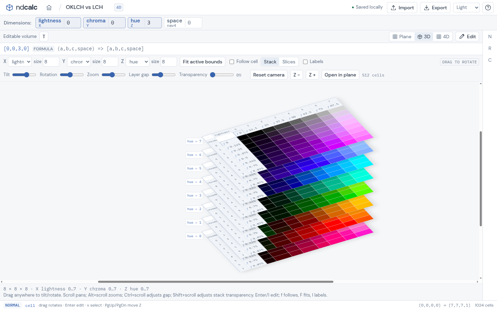
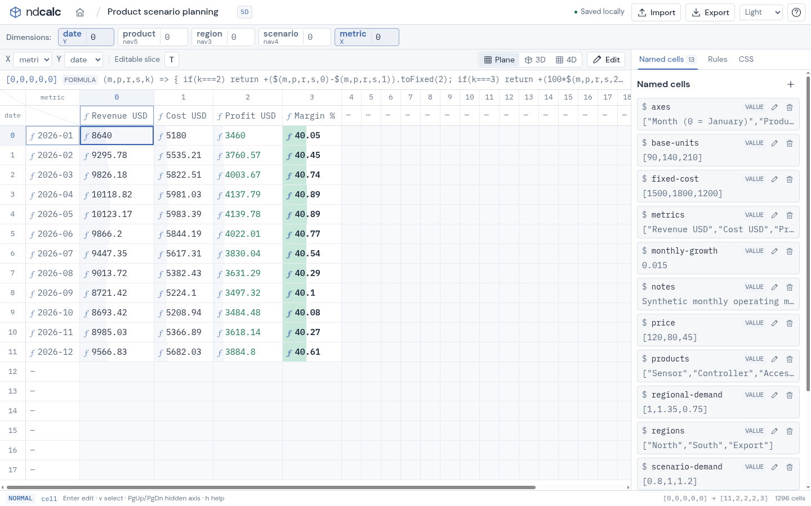
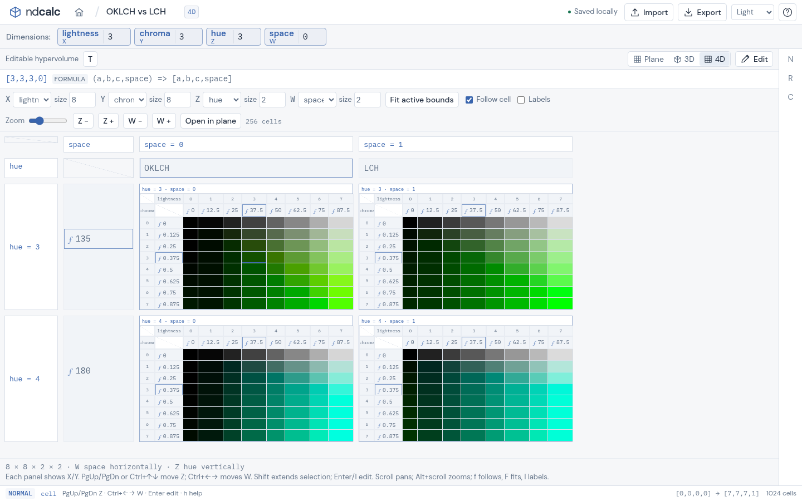

<p align="center">
  
</p>

<h1 align="center">ndcalc</h1>
<p align="center"><strong>A spreadsheet for data that doesn't fit in two dimensions.</strong></p>
<p align="center">Local-first · JavaScript formulas · Editable Plane, 3D &amp; 4D views</p>
<p align="center"><a href="https://alesya-h.github.io/ndcalc/">Open ndcalc</a> · <a href="#get-started">Get started</a> · <a href="#a-first-table">First table</a> · <a href="docs/reference.md">Reference</a> · <a href="docs/development.md">Development &amp; hosting</a></p>

A budget isn't just rows and columns: it's **month × product × region × scenario × metric**. A color study might be **lightness × chroma × hue × color space**. ndcalc keeps those dimensions in one table instead of spreading them across sheets.

Give your axes meaningful names, write JavaScript formulas, and explore the same data as a familiar grid, a stack of slices, or a four-dimensional panel matrix. Every view is editable. Your tables stay in your browser—no account or server required.


*The built-in OKLCH/LCH example: one table, eight hue slices, and a draggable 3D camera.*

## One table, different perspectives

| **Plane: work with a slice** | **4D: compare slices side by side** |
| --- | --- |
|  |  |
| Put any two axes on screen; keep the others at the coordinates you choose. | W runs across the page; Z runs down. Each panel is an editable X/Y grid. |

- **Real dimensions, not separate sheets.** Sparse tables support up to 32 axes, including negative coordinates. Switch axes without changing your data.
- **JavaScript, with spreadsheet references.** Store numbers, text, objects, or functions. Formulas can read other cells, named inputs, and editable axis headers.
- **Formatting that reveals structure.** Conditional colors, bars, classes, and document CSS work across all views. Hide labels to see the shape of your data.
- **Mouse, keyboard, and touch.** Select, fill, copy, undo, pan, and zoom. Drag the 3D stack to rotate; use one finger to pan or two to pinch-zoom.
- **Local by default.** Autosave to IndexedDB, reopen a table on refresh, and export JSON backups. Fonts are bundled; the app makes no external requests of its own.

## Get started

**[Open ndcalc in your browser →](https://alesya-h.github.io/ndcalc/)** No installation or account needed.

Or run locally with **Node.js 20+ and Java 17+**:

```sh
git clone https://github.com/alesya-h/ndcalc.git
cd ndcalc
npm ci
npm run dev
```

Open **[localhost:8080](http://localhost:8080)**. A fresh browser starts with the 5D example. Click **Home** to open another example or create a blank table.

Want to host your own copy? The compiled app lives on the [`gh-pages` bookmark/branch](https://github.com/alesya-h/ndcalc/tree/gh-pages). See the [hosting guide](docs/development.md#github-pages) for serving it or enabling GitHub Pages; no application server is needed.

## A first table

1. **Create it.** Home → **New table**. Choose a name and dimension count. Use the dimensional badge to give axes aliases such as `date`, `product`, and `scenario`.
2. **Put data in it.** Double-click a cell or press **Enter**. Choose **Text** for ordinary text, **Value** for a JavaScript expression, or **Formula** for a calculation. **Ctrl+Enter** applies the editor.
3. **Name the coordinates.** Click the value headers beside the raw coordinate numbers to enter dates, labels, rates, or units. Headers are cells too: formulas can read them.
4. **Explore it.** Choose X/Y in the axis dropdowns, change fixed coordinates in the dimension chips, or switch to **3D** or **4D**. The full axis order stays with the table.
5. **Keep a backup.** Changes autosave locally. **Export** downloads a source-preserving `.ndcalc.json`; **Import** opens a fresh copy, never overwriting an existing table.

### A tiny formula example

In a two-dimensional table, enter `10` at `[0,0]` and `20` at `[1,0]`. Open `[2,0]`, choose **Formula**, and enter:

```js
=> $(0, 0) + $(1, 0)
```

The cell displays **30**. Edit either input and it recalculates.

For a larger table, use named inputs and axis values rather than hardcoding everything:

```js
=> $("unit-price") * $("quantity")     // named input cells
=> _.offset("date", -1).value() * 1.05 // previous date coordinate
=> $$.department                     // this coordinate's department header
```

See the [formula and coordinate reference](docs/reference.md#cells-and-coordinates) for the full syntax.

### Useful controls

| Do this | Use this |
| --- | --- |
| Move / extend a selection | Arrows / Shift+arrows |
| Edit / edit as Formula / edit as Text | Enter / Shift+Enter / Alt+Enter |
| Apply / cancel an editor | Ctrl+Enter / Escape |
| Cycle Plane → 3D → 4D | `t` |
| Cycle the visible axis order | `T` |
| Move along the third / fourth axis slot | PgUp/PgDn / Ctrl+Left/Right |
| Copy / paste / undo | `y` / `p` / `u` |
| Pan / zoom | Scroll / Alt+scroll; swipe / pinch |
| Show the keyboard guide | `h` or `?` |

Buttons cover the same common actions. The [full keyboard guide](docs/reference.md#modal-keyboard-editing) includes higher-dimensional navigation and header selections.

## Start with an example

Every example opens as a **new saved table**, so experimenting won't change an existing one.

| Example | Explore |
| --- | --- |
| **5D example** | Metrics, departments, scenarios, currencies, and periods |
| **OKLCH vs LCH** | Two color spaces across lightness, chroma, and hue |
| **Heat diffusion** | A temperature field across time and materials |
| **Membrane eigenmodes** | Signed amplitudes and nodal lines |
| **Product scenario planning** | Revenue, costs, profit, and margin across five axes |
| **Beam design envelope** | Span, load, section, material, and utilization |
| **Double-entry ledger** | Department budgets, postings, and live balance checks |
| **Interference atelier** | Procedural gradients, phase, and animated motifs |

These are illustrative models with synthetic data, not engineering certification or financial advice.

## Your data and your code

Tables are stored **in this browser, on this origin**. A table's URL reopens that local document; it doesn't share its contents with somebody else. Export before clearing browser data or moving between localhost and a hosted site.

**Formulas and imported documents are trusted JavaScript, not sandboxed code.** They can access browser APIs or make network requests. Only import documents you trust; the bundled app itself doesn't send your tables anywhere.

---

[Detailed reference](docs/reference.md) · [Build, test & deploy](docs/development.md) · [Contributor notes](AGENTS.md)

Built with ClojureScript, Reagent, and React. Bundled fonts: DM Sans and IBM Plex Mono ([licenses](public/fonts/)).
